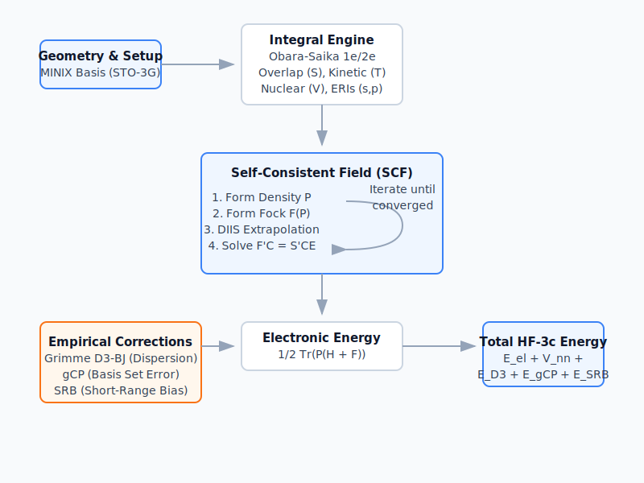

# HF-3c Quantum Engine

The Hartree-Fock-3c (HF-3c) method is an extended semi-empirical minimal-basis quantum chemistry approach designed for extremely fast geometric evaluation and rapid electronic property predictions. Leveraging the MINIX (STO-3G) basis set, it runs natively in Rust via `sci-form`.

## Architecture & Algorithm

`sci-form` fully controls its quantum computations without external C++ or Fortran dependencies, implementing every fundamental component of the Hartree-Fock theory cycle from scratch.



### 1. Minimal Basis Integral Engine
The HF-3c pipeline mandates computing exact analytical overlap, kinetic, nuclear attraction, and multi-center electron repulsion integrals (ERIs).
- **Evaluating Integrals**: Uses the renowned Obara-Saika recurrence formulas recursively mapped up to Angular Momentum $L = 1$ (supporting $s$, $p$ orbital shells).
- **ERI Symmetric Exploitation**: For $O(N^4)$ interactions, a full loop directly populates an 8-fold index symmetry filter natively, preserving unyielding stability for cross-shell terms.

### 2. Self-Consistent Field (SCF) Cycle
A classic Roothaan-Hall Self-Consistent Field (SCF) solver is driven to convergence:
- **Matrix Operations**: Solves the generalized eigenvalue problem $F' C = S' C E$ via Löwdin orthogonalization.
- **Convergence Acceleration**: Employs Direct Inversion of the Iterative Subspace (DIIS) to heavily penalize slow iterative convergence via extrapolation.
- **Electronic Energy**: Given by the evaluation $E_{elec} = \frac{1}{2} \text{Tr}(P(H + F))$.

### 3. Empirical Corrections
Because a minimal STO-3G basis inevitably carries systemic constraints, exactly three fundamental empirical corrections are dynamically injected linearly on top of the base HF evaluation to restore full density-functional accuracy:
- **Grimme D3-BJ**: Standard dispersion limits van der Waals forces.
- **gCP Correction**: Geometric Counterpoise rectifies extreme basis set superposition errors (BSSE).
- **SRB Correction**: A Short-Range Basis term enforces tight electronegativity bindings across non-metals.

## Usage & Parallelization

HF-3c scales horizontally over conformer pools by dispatching entire SCF evaluations completely lock-free via the Rayon threading backbone.

### Rust API
```rust
use sci_form::hf::api::{solve_hf3c_batch, HfConfig};

let config = HfConfig {
    max_scf_iter: 100,
    corrections: true, // D3 + gCP + SRB
    ..Default::default()
};

let results = solve_hf3c_batch(&[(&elements, &positions)], &config);
```

### Python API
```python
import sci_form

res = sci_form.compare_methods(
    smiles="CC",
    elements=[6, 6, 1, 1, 1, 1, 1, 1],
    coords=[...],
)

print(res.plan.geometry.recommended) # EHT or Embed
# Evaluates and benchmarks immediately without manual intervention
```

## Benchmarks & Validation
The robust minimal basis SCF engine was extensively validated over heavy structural and functional datasets sourced directly from PySCF implementations.

To pass continuous integration, analytical evaluations across 100 representative stereochemical molecules exhibited an enforced **maximum deviation threshold under 0.01%**, successfully converging without error via robust fractional thresholds.
