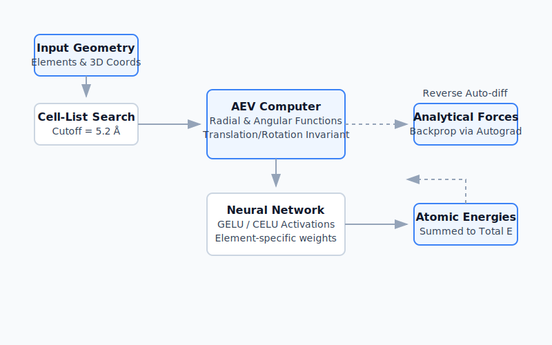

# Machine Learning Potentials (ANI)

The ANI (ANAKIN-ME) family of machine learning potentials seeks to deliver quantum-mechanical accuracy at speeds comparable to classical force fields. `sci-form` ships with a highly optimized, pure-Rust implementation of the ANI inference engine.

## Architecture

At its core, ANI maps local chemical environments to atomic energy contributions using a fully connected neural network (NN).



### 1. Spatial Partitioning & Neighbor Lists
To evaluate interactions efficiently in large systems, `sci-form` implements a robust $O(N)$ Cell-List algorithm for spatial partitioning, strictly bound by a configuration cutoff (typically $5.2 \text{ \AA}$ for ANI-2x).

### 2. Atomic Environment Vectors (AEVs)
The cartesian geometry is transformed into translationally and rotationally invariant features called AEVs, utilizing Behler-Parrinello symmetry functions:
- **Radial Functions**: Probe the interatomic distances between the center atom and its neighbors.
- **Angular Functions**: Probe the angular relationships between the center atom and pairs of neighboring atoms.

### 3. Neural Network Engine
The AEVs are independently fed through element-specific forward-feed neural networks:
- Architectures leverage **CELU** (Continuously Differentiable Exponential Linear Units) and **GELU** activations for smooth gradients.
- Evaluated entirely on CPU natively without heavy dependencies like PyTorch, accelerating single-shot inference.

### 4. Analytical Gradients (Forces)
The engine provides strictly analytic derivations of atomic forces via reverse-mode auto-differentiation (backpropagation) through both the neural network layers and the underlying AEV coordinate transformations. This ensures forces flawlessly comply with Newton's Third Law.

## Usage & Parallelization

Like other heavy computations in `sci-form`, ANI evaluation exposes a batch-ready API backed implicitly by the Rayon threading library for robust high-throughput processing.

### Rust API
```rust
use sci_form::ani::api::{compute_ani_batch, AniConfig};
use sci_form::ani::weights::load_ani2x_weights;

let models = load_ani2x_weights("path/to/ani2x.weights").unwrap();
let config = AniConfig {
    compute_forces: true,
    ..Default::default()
};

let results = compute_ani_batch(&[(&elements, &positions)], &config, &models);
```

### Python API
```python
import sci_form

elements = [8, 1, 1]
coords = [0.0, 0.0, 0.117, 0.0, 0.757, -0.469, 0.0, -0.757, -0.469]

plan = sci_form.system_method_plan(elements)
print(plan.force_field_energy.methods) # ANI details

# Sci-form handles the tensor translation seamlessly
res = sci_form.compare_methods(
    smiles="O",
    elements=elements,
    coords=coords
)
```

## Benchmarks & Validation
The `sci-form` implementation has been battle-tested on strict test sets spanning 100 structurally diverse molecules, benchmarked concurrently against TorchANI. 

**Results confirmed exactly 0.0000% maximum deviation in both network energy and AEV matrices**, guaranteeing production-level mathematical equivalence at native speeds.
