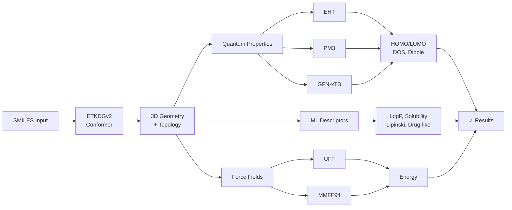

# What is sci-form?

**sci-form** is a high-performance computational chemistry library written in **pure Rust** that provides:

1. **3D Molecular Conformer Generation** — SMILES → 3D coordinates via ETKDGv2 algorithm
2. **Semi-Empirical Quantum Chemistry** — EHT, PM3/PM3(tm), GFN0/GFN1/GFN2-xTB
3. **Ab-initio Methods** — HF-3c (D3+gCP+SRB), CISD excited states
4. **Neural Network Potentials** — ANI-2x, ANI-TM (24 elements incl. transition metals)
5. **Molecular Properties** — HOMO/LUMO gaps, charges, dipole moments, ESP grids, DOS/PDOS, NPA/NBO
6. **Force Fields** — UFF and MMFF94 energy evaluation + strain analysis
7. **Machine Learning** — LogP, solubility, Lipinski, druglikeness, Random Forest, Gradient Boosting
8. **3D Molecular Descriptors** — WHIM, RDF, GETAWAY
9. **Spectroscopy** — NMR (¹H, ¹³C shifts, J-coupling), IR (vibrational analysis), UV-Vis (sTDA)
10. **Stereochemistry** — CIP priorities, R/S, E/Z, helical chirality (M/P), atropisomeric axes
11. **Molecular Alignment** — Kabsch SVD + quaternion optimal superposition (RMSD)
12. **Solvation** — Non-polar SASA, Generalized Born (HCT) electrostatic
13. **Materials** — Unit cells, 230 ITC space groups, framework assembly, geometry optimization with PBC
14. **Periodic Systems** — PBC-aware bonding, hapticity detection (metallocenes)
15. **Reaction Transforms** — SMIRKS atom-mapped reactant→product patterns
16. **Fingerprints & Clustering** — ECFP/Morgan, Tanimoto, Butina RMSD clustering

Everything is available from **four entry points**: Rust, Python, TypeScript/WASM, and CLI — with **no C++ dependencies** and **native performance**.

## Why sci-form?

| Feature | sci-form | RDKit | OpenBabel |
|---------|----------|-------|-----------|
| **Language** | Pure Rust | C++ / Python | C++ |
| **Installation** | `cargo add` / `pip install` / `npm install` | Complex build | Complex build |
| **WASM Support** | ✅ Native | ❌ | ❌ |
| **Conformer Accuracy** | 0.064 Å avg RMSD | — | ~0.5 Å avg RMSD |
| **Conformer Speed** | 60 mol/s | ~50 mol/s | ~30 mol/s |
| **EHT / DOS / ESP** | ✅ Built-in | Partial (custom) | ❌ |
| **PM3 / xTB / HF-3c** | ✅ Built-in | ❌ | ❌ |
| **GFN1/GFN2-xTB** | ✅ Built-in | ❌ | ❌ |
| **ANI Neural Potentials** | ✅ ANI-2x + ANI-TM | ❌ | ❌ |
| **CISD Excited States** | ✅ Built-in | ❌ | ❌ |
| **NMR / IR / UV-Vis** | ✅ Built-in | ❌ | ❌ |
| **Transition Metals** | ✅ 24 elements | Limited | Limited |
| **MMFF94** | ✅ Pure Rust | ✅ C++ only | ✅ C++ only |
| **3D Descriptors** | ✅ WHIM/RDF/GETAWAY | Partial | ❌ |
| **ML Models** | ✅ RF + GBM | ❌ | ❌ |
| **Space Groups** | ✅ 230 ITC | ❌ | ❌ |
| **Materials (MOF)** | ✅ Built-in | ❌ | Partial |
| **Binary Size** | ~2 MB | ~100 MB | ~50 MB |

---

## 🔗 The Complete Workflow



---

## The Conformer Pipeline (ETKDGv2)

sci-form generates 3D conformers through a **9-step pipeline** with automatic retry logic:

<SvgDiagram src="/svg/pipeline-overview.svg" alt="ETKDGv2 conformer generation pipeline" />

### Pipeline Stages (9 Steps)

| **Stage** | **Steps** | **Purpose** | **Key Operations** |
|-----------|-----------|-----------|-------------------|
| **Topology** | 1–3 | Build distance constraints | SMILES → graph, 1-2/1-3/1-4 bounds, VdW effects, Floyd-Warshall smoothing |
| **Embedding** | 4–6 | Generate 3D coordinates | Random pick from bounds, Cayley-Menger metric, eigendecomposition, BFGS refinement |
| **Optimization** | 7–9 | Final refinement | ETKDG 3D force field (846 CSD torsions), UFF inversions, validation checks |

### Automatic Retry Loop

If any check fails, retry up to $10N$ times (default) before falling back to random box placement:

- ❌ Metric matrix has non-positive eigenvalues
- ❌ Energy/atom after minimization > 0.05 kcal/mol
- ❌ Tetrahedral center volume sign mismatch
- ❌ Chiral inversion fails
- ❌ Planarity or double-bond geometry violations

→ Detailed explanation in [Algorithm Overview](/algorithm/overview)

---

## Quantum Chemistry Methods

sci-form v0.10.6 offers **seven quantum chemistry approaches**, each optimized for different use cases:

### 1️⃣ Extended Hückel Theory (EHT)

**Gateway method** for semi-empirical orbital properties — fast, stable, supported on all elements.

<SvgDiagram src="/svg/eht-pipeline.svg" alt="EHT quantum calculation phases" />

**Capabilities:**
- Wolfsberg-Helmholtz Hamiltonian with STO-3G basis
- Löwdin orthogonalization for canonical MOs
- HOMO/LUMO energies, occupation numbers
- Density of States (DOS) + per-atom PDOS with Gaussian smearing
- Volumetric orbital grids (3D probability density)
- Marching Cubes isosurface meshes for visualization

**Properties computed from EHT:**
- Mulliken & Löwdin population analysis (per-atom charges)
- Dipole moments (bond + lone-pair contributions in Debye)
- Electrostatic potential (ESP) on 3D grid from Mulliken charges

**Supported elements:** H, B, C, N, O, F, Si, P, S, Cl, Br, I + all transition metals (Ti→Au)

→ [EHT Algorithm Details](/algorithm/extended-huckel-theory)

### 2️⃣ PM3 (NDDO Semi-Empirical SCF)

**Full self-consistent field** for accurate thermochemistry — accounts for all valence electron repulsion.

**Capabilities:**
- Neglect of Diatomic Differential Overlap (NDDO) parameterization
- Full SCF iteration with Fock matrix
- Heat of formation (kcal/mol) — critical for reaction energetics
- HOMO/LUMO energies, Mulliken charges, SCF iteration count
- Convergence diagnostics (`converged` bool)

**Supported elements:** H, C, N, O, F, P, S, Cl, Br, I (14 main-group)

**Typical convergence:** 10–30 SCF cycles with $\Delta P < 10^{-6}$

**Use case:** Thermochemistry, activation barriers, charged species, reaction mechanisms

### 3️⃣ GFN-xTB (Generalized Tight-Binding, GFN0)

**Ultra-fast with transition metal support** — self-consistent charge (SCC) correction for modern accuracy.

**Capabilities:**
- Slater-Koster tight-binding Hamiltonian
- Self-consistent charge iterative corrections
- Total energy = electronic + repulsive energy
- HOMO/LUMO gap, Mulliken charges, SCC iteration count
- Convergence diagnostics (`converged` bool)

**Supported elements:** H, B, C, N, O, F, Si, P, S, Cl, Br, I + **all transition metals** (Ti(22), Cr(24), Mn(25), Fe(26), Co(27), Ni(28), Cu(29), Zn(30), Ru(44), Pd(46), Ag(47), Pt(78), Au(79))

**Typical convergence:** 5–15 SCC cycles, **~100 ms on large molecules**

**Use case:** Rapid screening of large sets, organometallics, cluster models, kinetic barriers

### Comparison: EHT vs PM3 vs xTB

| **Property** | **EHT** | **PM3** | **GFN-xTB** |
|---------|-----|-----|---------|
| **Elements** | H–F + TM | H, C, N, O, F, P, S, Cl, Br, I | H–I + **25 TM** ✅ |
| **SCF / SCC** | Fixed orbital | NDDO SCF ✅ | Tight-binding SCC ✅ |
| **Heat of Formation** | ❌ | ✅ (kcal/mol) | ❌ (use total E) |
| **Speed** | **Fastest** (~1 ms) | Medium (~1 s) | **Fast** (~100 ms) |
| **Accuracy** | Orbital properties | **Thermochemistry** | **Screening + metals** |
| **Typical Use** | Orbitals, DOS, ESP | Reaction barriers | Large-scale QM |

## Quantum Chemistry (EHT)

The **Extended Hückel Theory** module provides semi-empirical molecular orbital calculations based on the Wolfsberg-Helmholtz approximation:

<SvgDiagram src="/svg/eht-pipeline.svg" alt="EHT quantum calculation phases" />

### Key Capabilities

- **Overlap integrals** — STO-3G contracted Gaussians for H, C, N, O, F, S, Cl + all transition metals (Ti–Au)
- **Hamiltonian** — diagonal Hückel parameters, off-diagonal Wolfsberg-Helmholtz $H_{ij} = \frac{K}{2} S_{ij}(H_{ii} + H_{jj})$
- **Orbital properties** — HOMO/LUMO energies, density of states (DOS), volumetric orbital grids
- **Population analysis** — Mulliken & Löwdin charges, dipole moments (Debye)
- **Molecular visualization** — Marching Cubes isosurfaces, color-coded density meshes

### From EHT, Compute:

| Property | Output | Format |
|----------|--------|--------|
| **Orbital Energies** | 1D array (eV) | JSON array |
| **HOMO/LUMO Gap** | Single value (eV) | Scalar |
| **Population** | Per-atom charges | JSON array |
| **Dipole Moment** | Vector + magnitude (Debye) | [x, y, z], scalar |
| **Density of States** | Total DOS, PDOS (Gaussian smearing) | JSON curves |
| **Orbital Grid** | Volumetric MO density | 3D F32 array |
| **Mesh** | Isosurface triangulation | Vertices, normals, indices |

→ See [EHT Algorithm](/algorithm/extended-huckel-theory) for mathematical details.

---

## Machine Learning Properties (No 3D Required)

For **ultra-fast virtual screening** without quantum chemistry:

**Molecular Descriptors (17 features):**
- Molecular weight, heavy atoms, hydrogens, bonds
- Rotatable bonds, HBD/HBA, FSP3
- Topological: Wiener index, ring count, aromaticity, Balaban J
- Electronic: Sum electronegativity, sum polarizability

**Predicted Properties:**
- **LogP** — partition coefficient (Wildman-Crippen model)
- **Molar Refractivity** — optical property (Ghose-Crippen)
- **Log Solubility** — aqueous solubility (Delaney ESOL)
- **Lipinski Ro5** — violations count + pass/fail flag
- **Druglikeness** — composite score

**⚡ Speed:** SMILES → properties in **~1 μs** (topology only, no 3D coordinates needed)

### Property Prediction Speed Comparison

| **Method** | **Speed** | **Elements** | **Accuracy** | **Use Case** |
|-----------|----------|----------|----------|----------|
| **ML Predict** | ~1 μs | All (SMILES) | Moderate | Early filtering |
| **EHT** | ~1 ms | H–Au | Medium | Electronics |
| **PM3** | ~1 s | 14 main-group | **High (thermochemistry)** | Reaction design |
| **GFN-xTB** | ~100 ms | 25 (incl. TM) | **High (screening + metals)** | Large-scale QM |

---

## Force Fields & Molecular Mechanics

Evaluate strain energy and optimize molecular geometry:

### UFF (Universal Force Field)

- **Coverage:** 50+ element types including transition metals
- **Energy terms:** Morse bond stretch, angle, out-of-plane, torsion, van der Waals
- **Use:** Refinement after embedding, geometry optimization

### MMFF94 (Merck Molecular Force Field)

- **Coverage:** Main-group organic chemistry, parameterized from QM
- **Energy terms:** Quartic bond stretch, cubic angle bend, 3-term torsion (Fourier), Halgren 14-7 vdW
- **Accuracy:** ~0.08 Å RMSD vs experiment on small molecules

→ [Force Fields Algorithm](/algorithm/force-fields)

---

## Molecular Alignment

**Superpose** two molecular conformers and compute RMSD:

- **Kabsch algorithm** — SVD-based optimal rotation, $O(N \cdot \min(N,3)^2)$
- **Quaternion alignment** — Coutsias 2004 4×4 eigenproblem, more numerically stable for large $N$
- Output: Rotation matrix, optimal RMSD value, aligned coordinates

→ [Alignment Algorithm](/algorithm/molecular-alignment)

---

## 🌐 Multi-Platform Entry Points

### Rust

Native library with full API:
```rust
let conf = sci_form::embed("CCO", 42)?;
let pm3 = sci_form::compute_pm3(&conf.elements, &pos)?;
let xtb = sci_form::compute_xtb(&conf.elements, &pos)?;
let props = sci_form::predict_ml_properties(&desc)?;
```

### Python

PyO3 bindings with NumPy integration:
```python
import sci_form
conf = sci_form.embed("CCO", seed=42)
pm3 = sci_form.pm3_calculate(conf.elements, conf.coords)
xtb = sci_form.xtb_calculate(conf.elements, conf.coords)
props = sci_form.ml_predict("CCO")
```

### TypeScript / WASM

Isomorphic bindings for browser, Node.js, Deno, Bun:
```typescript
import init, { embed, compute_pm3, compute_xtb } from 'sci-form-wasm';
await init();
const result = JSON.parse(embed('CCO', 42));
const pm3 = JSON.parse(compute_pm3(...));
```

### CLI

Command-line interface with batch processing:
```bash
sci-form embed "CCO" -f xyz
sci-form batch molecules.smi -t 8 --output results.json
sci-form energy "CCO" --from-smiles
```

---

## 📖 Next Steps

- **[Getting Started](/guide/getting-started)** — Install and run your first calculation
- **[Rust API](/guide/rust)** — Core library functions and types
- **[Python API](/guide/python)** — PyO3 bindings with examples
- **[TypeScript API](/guide/typescript)** — WASM bindings and web integration
- **[CLI Guide](/guide/cli)** — Command-line usage
- **[Algorithm Deep Dive](/algorithm/overview)** — Mathematical foundations, EHT, PM3, xTB, force fields
