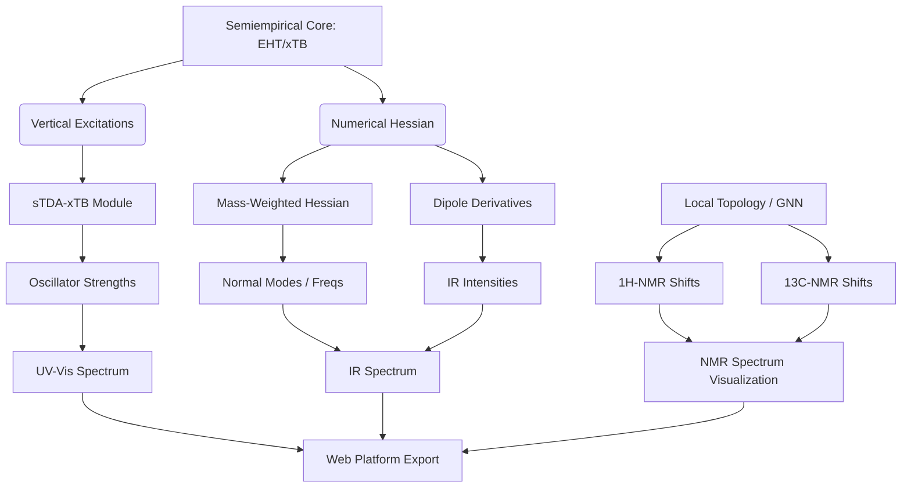

# Track D: Advanced Spectroscopy and Response Properties

Building on the existing electronic structure (Track B) and ML (Track C) foundations, Track D expands the library into response properties and experimental observable simulation.

## Overview Diagram

---

## Phase D1: UV-Vis Spectroscopy (Speed & Accuracy)

The goal is to provide "ultrafast" UV-Vis predictions suitable for large-scale screening and real-time WASM visualization.

### 1.1 Vertical Excitations (sTDA-xTB)
- **Methodology:** Implement the Simplified Tamm-Dancoff Approximation (sTDA) coupled with GFN-xTB (specifically the sTDA-xTB variant).
- **Why sTDA?** Full CIS or TD-DFT is too computationally expensive for WASM; sTDA captures the essential physics of excitations at a fraction of the cost.
- **Components:**
    - Vertical excitation energy calculation ($E_{exc}$) from HOMO/LUMO and surrounding MOs.
    - Transition dipole moment $\langle \Psi_0 | \hat{\mu} | \Psi_n \rangle$ evaluation using transition density.
    - Oscillator strength ($f_{osc}$) derived from transition dipoles.

### 1.2 Spectral Broadening
- **Logic:** Reuse the Gaussian smearing infrastructure from `src/dos/dos.rs`.
- **Customization:** Add support for Lorentzian line shapes or mixed Voigt profiles to simulate experimental broadening.
- **Output:** Continuous spectral data (Absorbance vs. wavelength in nm or energy in eV).

---

## Phase D2: IR Spectroscopy (Hessian Infrastructure)

Implementation of vibrational analysis through numerical differentiation of the energy gradients.

### 2.1 Numerical Hessian & Frequencies
- **Approach:** $6N$ displacements ($\pm \delta$ along x, y, z for each of the $N$ atoms) to construct the $3N \times 3N$ Hessian matrix $\mathbf{H}_{ij} = \frac{\partial^2 E}{\partial x_i \partial x_j} = \frac{\partial g_i}{\partial x_j}$.
- **Parallelization:** Utilize `rayon` to parallelize the gradient evaluations. Since semiempirical gradients are fast, the $6N$ overhead remains micro-to-milli second for typical small molecules.
- **Diagonalization:** Solve the mass-weighted eigenvalue problem to obtain vibrational frequencies ($\omega$) and normal mode vectors (displacements).

### 2.2 IR Intensities
- **Logic:** Calculate the derivative of the molecular dipole moment $\vec{\mu}$ with respect to the normal coordinates.
- **Implementation:** $I_k \propto \left| \sum_i \frac{\partial \vec{\mu}}{\partial x_i} \mathbf{L}_{ik} \right|^2$, where $\mathbf{L}$ is the normal mode matrix.
- **Outcome:** Synthetic IR spectrum with peak intensities reflecting charge flux during vibrations.

---

## Phase D3: NMR Spectroscopy (ML & Empirical Route)

Pure quantum-mechanical NMR (via GIAO) is theoretically dense and computationally expensive. We implement a pragmatic, ultra-fast ML/Topological approach. For a deep dive into the 4-phase NMR strategy, see the [Detailed NMR Implementation Roadmap](file:///home/lestad/github/sci-form/docs/nmr_detailed_roadmap.md).

### 3.1 NMR Shift Prediction (1H & 13C)
- **Strategy:** Integrated Graph Neural Network (GNN) model or a topological HOSE-code (Hierarchically Ordered Spherical description of Environment) lookup.
- **Features:** Utilize local environment descriptors (electronegativity, hybridization, ring current effects) to predict chemical shifts in ppm.
- **Target:** Proton (1H) and Carbon (13C) chemical shifts with microsecond latency.

### 3.2 Coupling & Splitting
- **J-Coupling:** Use topological rules (e.g., Karplus equation for torsions) to estimate spin-spin coupling constants.
- **Integration:** Combine shifts and couplings to generate high-fidelity synthetic 1D NMR spectra.

---

## Verification & Testing Plan

### Automated Tests
- **UV-Vis:** Validate excitation energies for benchmark systems (Ethylene, Benzene, Formaldehyde) against reported sTDA values.
- **IR:** 
    - Verify Hessian symmetry ($H_{ij} = H_{ji}$) and rotational/translational invariance (non-zero frequencies > 6 counts).
    - Compare H2O/CO2 frequencies against experimental standards.
- **NMR:** Cross-validate predicted shifts against the BMRB or other curated NMR datasets.

### Performance Benchmarks
- Measure time scaling with system size for numerical Hessian (expected $O(N^2)$).
- Verify WASM execution time for the sTDA matrix diagonalization.
